

  

<h1>
  TrueNAS set up with Windows File Share.
</h1> 

<h2>Environments and Technologies Used</h2>
 
-Linux 
-Rufus 
-SMB 
-CLI 
-File Permissions 

_________________________________________________________________________________________

 
 
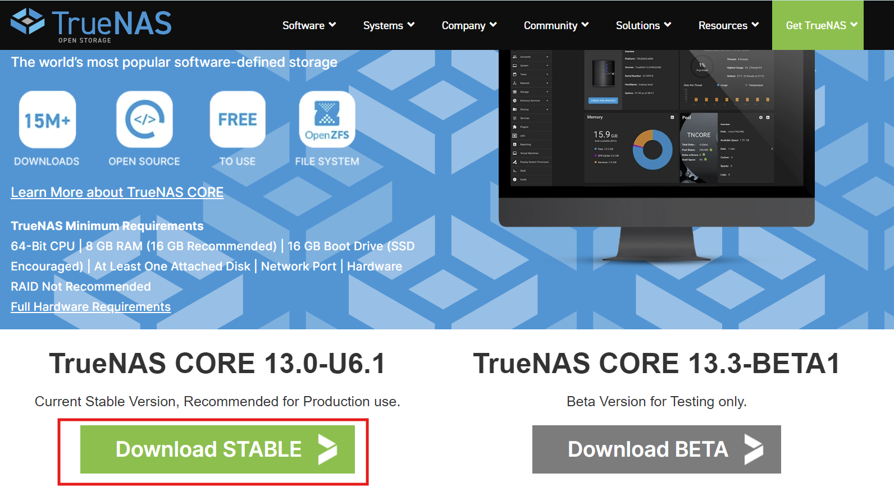
 
-Begin by going to https://www.truenas.com/ and downloading TrueNAS Core
  
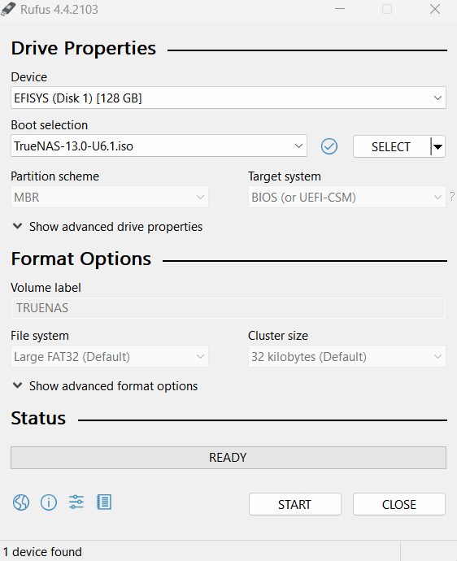
-Flash the ISO file on to a bootable media via Rufus.exe (There is a more detailed outline of this process in my Linux Deployment repo)
  
 
  
-When it is flashed you can plug it into the computer you want to install it on. You will be greeted with a screen like this. Follow the on-screen instructions.
  
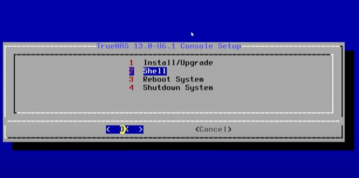
 
 
-When fully installed it is best to check on another device to make sure your installation was successful.
  
-Open the command line with "windows"+"R" and type "CMD"
 
-Run the command "arp -a". This will list all devices on your network. If you are unsure which device is your TrueNAS an IP address should be given to you on your TrueNAS computer. This method works to avoid needing a 2nd monitor.
 
-Next type the command "ping" to ensure you have a connection.
 
 
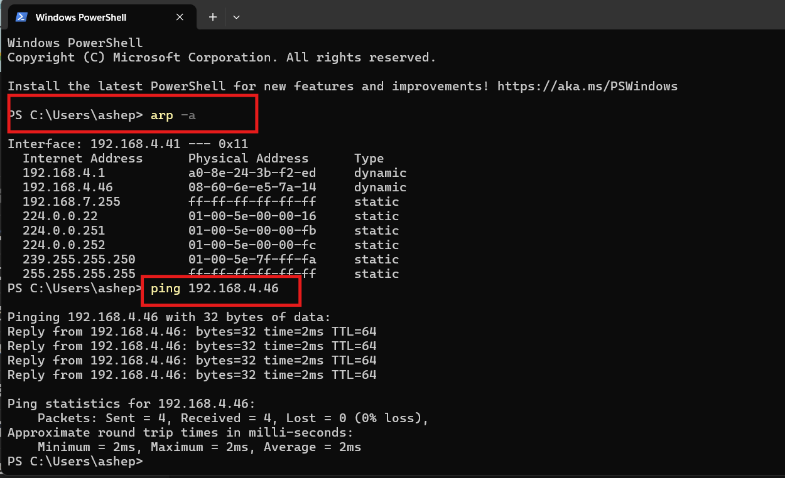
 
 
-Enter the IP address of your TrueNAS computer into a web browser in my case it is 192.168.4.46. You should get a dashboard that looks like this after entering your login credentials.
  
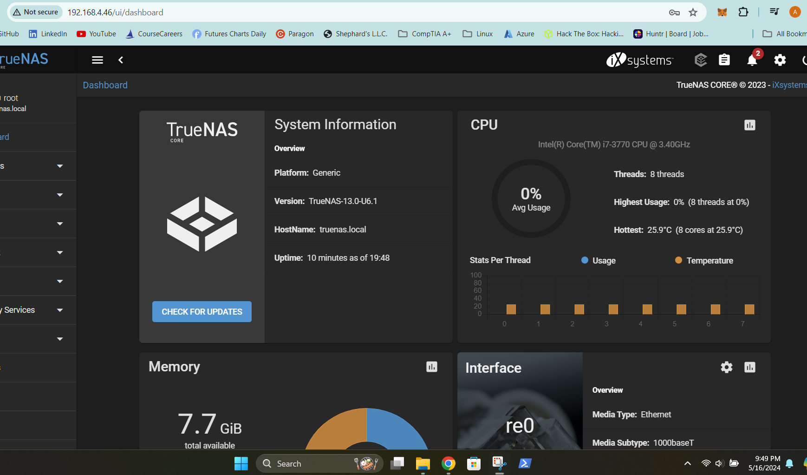
 
Next we will need to add a pool. Under the "Storage" tab select "Pools"
   
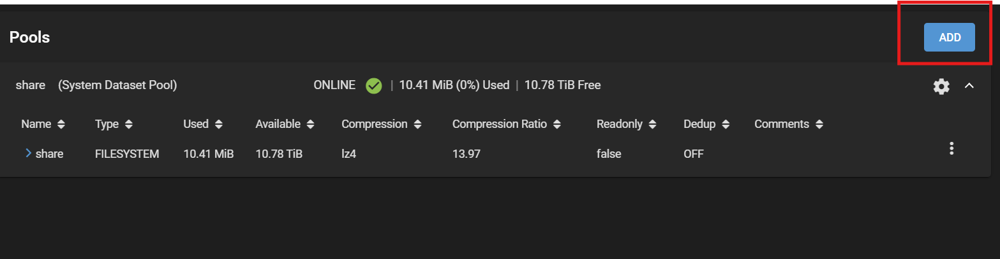
 
-Add a name and select your disk drive you would like to set up and share. Additionally we can set up a RAID configuration here. For a simple alternative select the "Suggest Layout" button.
   
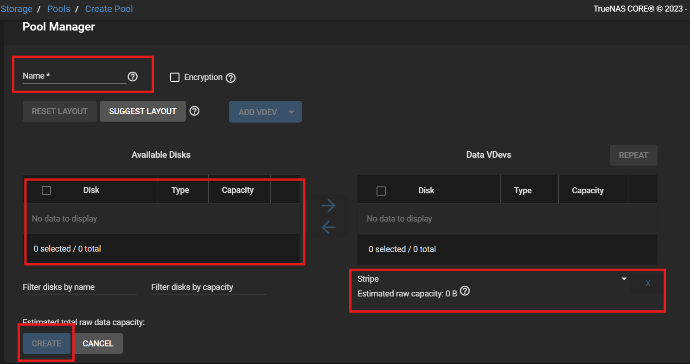
 
-Next go to the "Share" tab and select "Windows Shares (SMB)"
 
-Select the location of the folder you would like to share and submit with default share parameters.
  
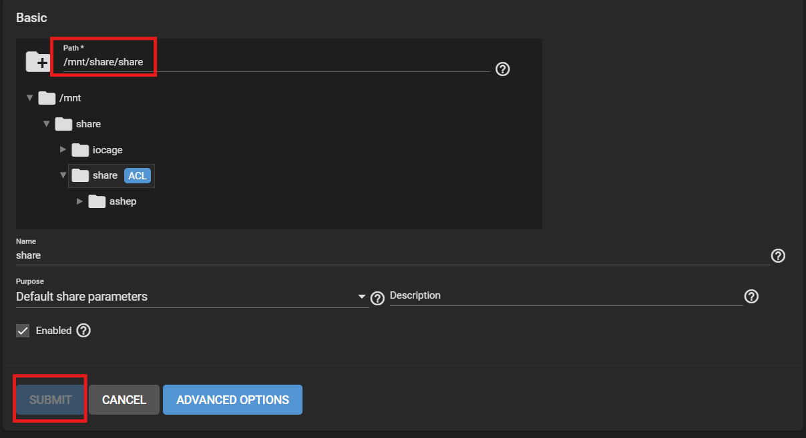
 
 
-Next go to "Accounts" and select "Users".
 
-We will make a user and assign permissions to the shared folder we just created. (Note you will have to check the boxes to give writing privileges)
  
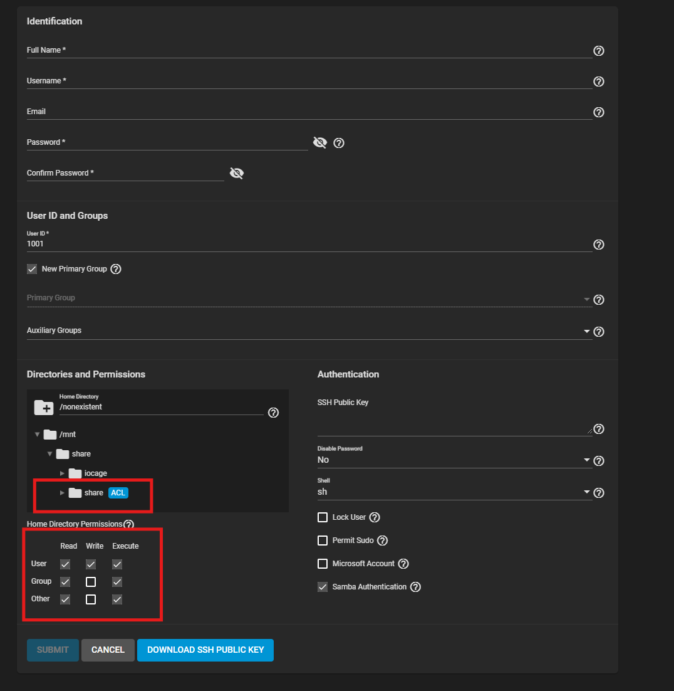
  
-In your file explorer on Windows there is a "Network" tab.  
-You should see a TRUENAS computer. If you do not search under the Network tab your IP address like this: \\192.168.4.46 (making sure to replace the IP with your TrueNAS machines)
  
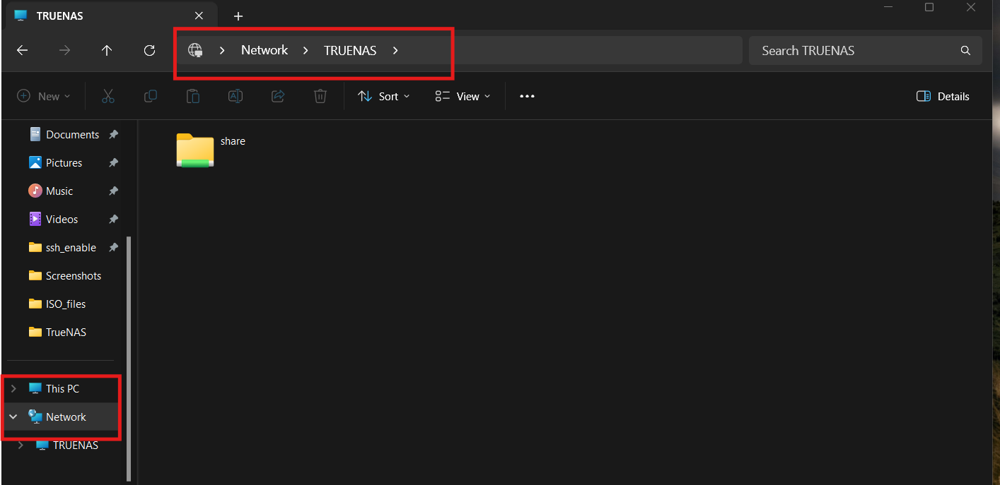
 
 
-Right-click the shared folder and select "Map network drive"
-This will create a drive that shows up right next to your "C:" drive.
  
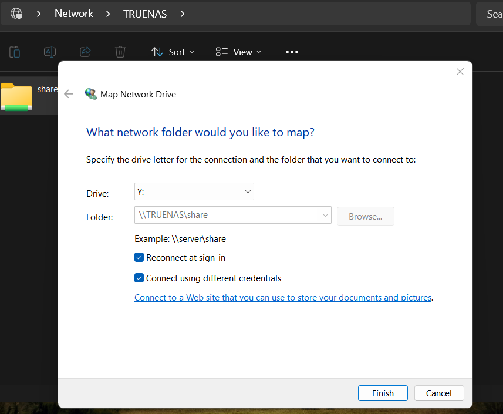
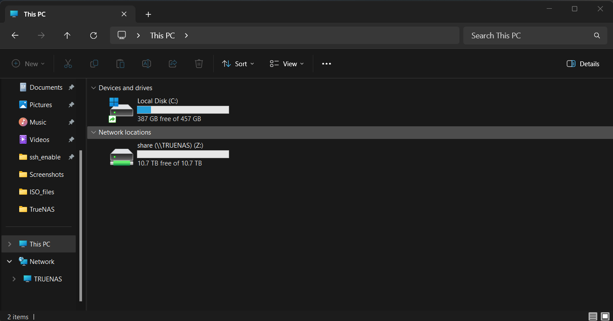
  
-Verify you can write to the file location with "hello_world.txt"
  
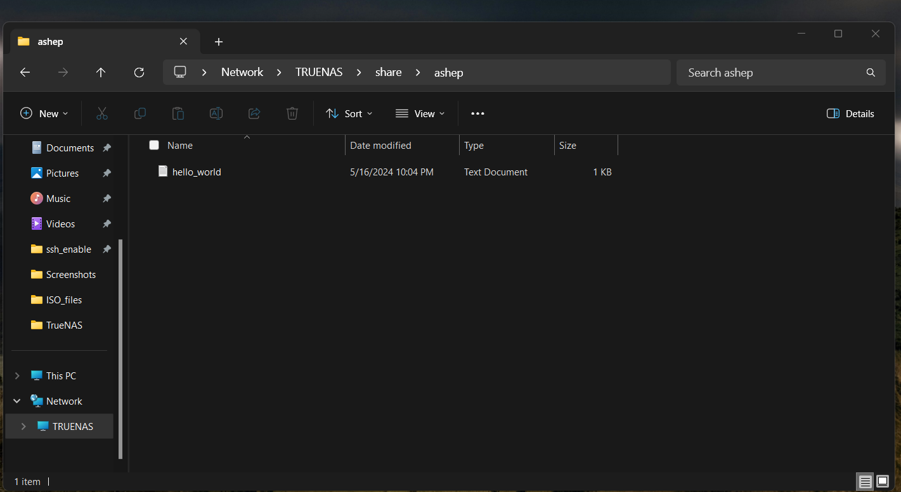
  
Congratulations on setting up a TrueNAS storage device!

